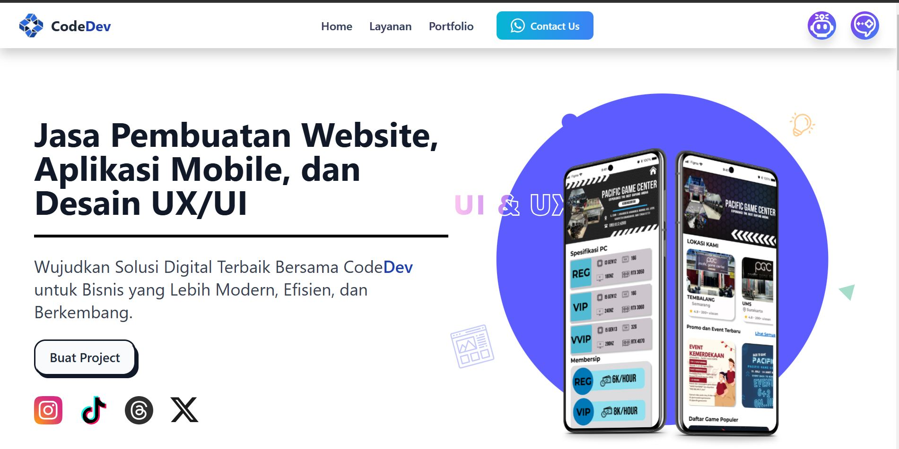

# Codev - Jasa Pembuatan Aplikasi Mobile (Frontend Only)

## 📌 Deskripsi
**Codev** adalah layanan jasa pembuatan aplikasi mobile berbasis frontend menggunakan **TypeScript** dan **Next.js**. Kami berfokus pada pengembangan antarmuka pengguna yang responsif, cepat, dan modern untuk berbagai kebutuhan bisnis dan startup.

## 🎯 Layanan Kami
- 🖥 **Pengembangan Frontend Mobile**: Membangun UI/UX yang menarik dan interaktif.
- 🎨 **Desain Responsif**: Optimasi tampilan untuk berbagai perangkat.
- ⚡ **Integrasi API**: Menghubungkan aplikasi frontend dengan backend yang telah tersedia.
- 🚀 **Optimasi Performa**: Menggunakan teknologi terbaru untuk memastikan kecepatan dan efisiensi aplikasi.

## 🛠 Teknologi yang Digunakan
- **Next.js** - Framework React yang powerful untuk frontend development.
- **TypeScript** - Bahasa pemrograman yang aman dan scalable.
- **Tailwind CSS** - Styling modern untuk tampilan yang elegan.

## 📌 Catatan
Saat ini Codev hanya menyediakan layanan **pengembangan frontend**, sehingga integrasi dengan backend akan dilakukan berdasarkan API yang disediakan oleh klien.

## LINK
- https://codedev-app.vercel.app/
